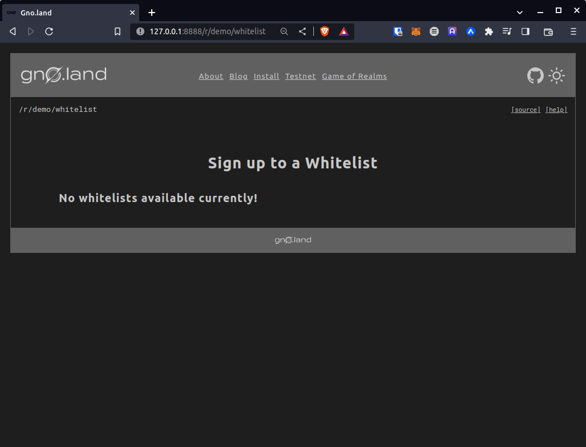
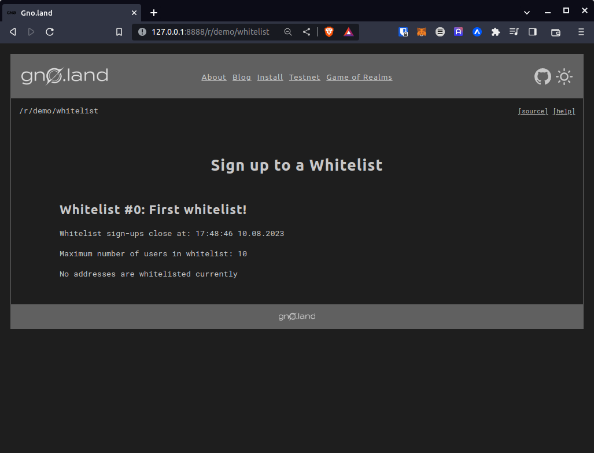
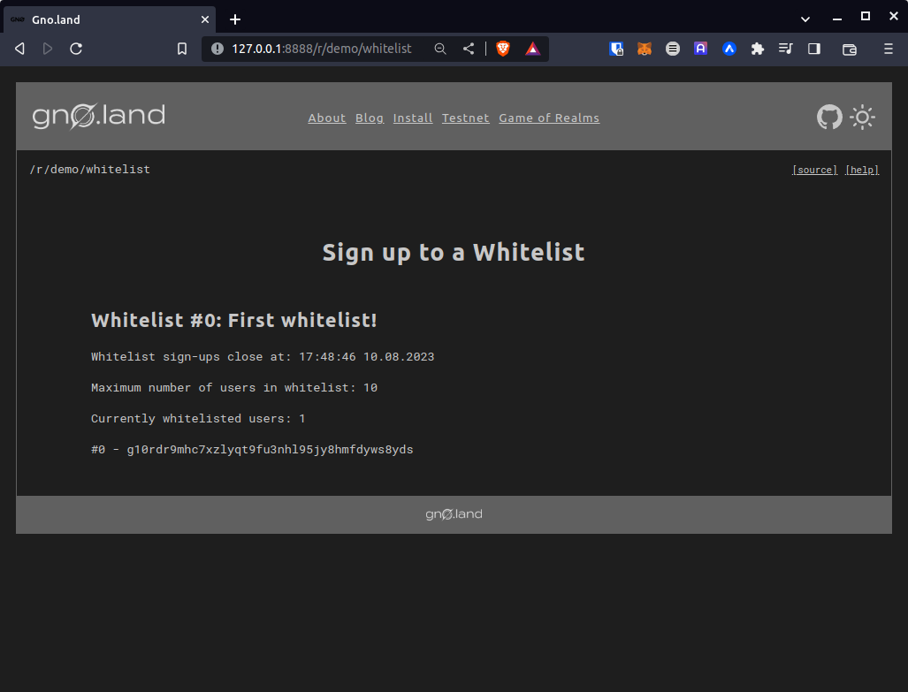

# From Zero to Gno.Land Hero

> _Written by @leohhhn, August 10th 2023_

In this tutorial, we will enter the world of **Gno.Land**, and build our own smart contract using the **Gno** programming language. Gno is an interpreted version of Golang that shares 99% of the functionality with Go, allowing us to write blockchain-specific code in a secure, battle-tested language that many developers already have in their skill set.

We will go over what Gno.Land is, and how you can use the full potential of Gno to build secure blockchain applications in a familiar blockchain language.

## Why Gno.Land?

Gno.Land is a layer 1 blockchain network based on Tendermint2 technology. It aims to offer security, scalability, and high-quality smart contract libraries to developers while also being interconnected with existing Cosmos chains via IBC1. Gno.Land comes with GnoVM, a VM which allows us to translate Gno to Go. Currently, Gno.Land has a development testnet out, with the mainnet release expected in Q1 of 2024. You can read more about Gno.Land [here](https://gno.land/).

## Tutorial overview

> _Note: Familiarity with Golang, although not a strict necessity, is highly recommended to follow this tutorial._

This tutorial will review the tools and procedures required to develop in Gno.Land. These are:

1. Environment setup
2. Generating a Gno.Land keypair with `Gnokey`
3. Writing & testing a smart contract in `Gno`
4. Hands-on coding
5. Using `Gnofaucet` & `Gnoweb` to get test tokens
6. Deploying our code to a local testnet

## Environment setup

Make sure you have installed the following:

- Go 1.19+
- Make (for using Makefiles)
- Git

To get started with development, we need to clone the full [Gno.Land repository](https://github.com/gnolang/gno):

```
git clone git@github.com:gnolang/gno.git
```

After going into the cloned repository, we can build and install the aforementioned tools with the following commands:

```
cd gno.land
make build && make install
```

This will make all of the required tools available via CLI.

The next step is building the GnoVM, which is required to compile and interpret Gno to Go.
From the `gno.land` subfolder, run the following commands:

```
cd ..
cd gnovm
make build && make install
```

This completes the environment setup.

To follow this tutorial, having the most up-to-date docs open is recommended. This is the [Gno Developer Portal](https://docs.onbloc.xyz/).

## Generating a Gno.Land keypair with Gnokey

To interact with the `Gno.Land` blockchain, we must generate a keypair. This is done using the [Gnokey](https://docs.onbloc.xyz/docs/cli/gnokey) CLI tool.

To generate a new keypair and add it to local storage, run:

```
gnokey add {your keypair name}
```

Next, `Gnokey` will ask you for a password to encrypt your keypair and save it under `{your keypair name}`.
This will generate a keypair based on a random BIP39 mnemonic phrase, which will be displayed shortly. Write this phrase down if you plan to use this keypair in the long run.

To see currently saved keypairs, run:

```
gnokey list
```

Here is a sample keypair named Dev:

```
$ gnokey list

0. Dev (local) - addr: g10rdr9mhc7xzlyqt9fu3nhl95jy8hmfdyws8yds pub: gpub1pgfj7ard9eg82cjtv4u4xetrwqer2dntxyfzxz3pq028mgdjsyjx6uzfcu7zu2nlmsn2yvqk458xh9trddjkta338xcqq94dfrt, path: <nil>
```

We will use the this address later.

Other than generating keypairs, `gnokey` is used to interact with the Gno.Land blockchain via the CLI. `Gnokey` can fetch information about an address, call functions on smart contracts and send state changes (transactions) to the network. This will be covered later.

## Writing & testing in Gno

In Gno.Land, smart contracts are called [Realms](https://docs.onbloc.xyz/introduction-to-gnoland/what-is-gnoland/concepts#realm). Here are three Gno.Land concepts we need to cover before diving into the actual development of Realms:

1. Packages vs. Realms
2. Render functions
3. Paths

### Packages vs. Realms

Gno.Land code can be divided into two main groups: packages & realms. Put simply, packages represent stateless code intended to be reused - libraries. Realms, on the other hand, represent smart contracts that can hold arbitrary state and functionality. Both packages and realms can be uploaded on-chain.

### Render functions

Each realm can implement a `Render` function which allows the developer of the realm to display the state the way they intend to. A render function should return a valid markdown string. Of course, similar to Solidity, Gno also has the concept of `view` functions, allowing the state of the contract to be displayed in an arbitrary UI.

### Paths

Gno.Land saves its packages and realms in a tree-like structure - similar to a classic file system. You can find added packages under the `"gno.land/p/"` path. When developing a realm in Gno, you can access and import these packages through their deployed paths.

A developer must provide a path to place their realm upon deployment. This provides a quick and easy way to access the state of Realms.

Let's get started with the code. We will build a simple app allowing users to sign up for a whitelist before a specific deadline.

## Hands-on coding

We will write a simple package and realm combination to act as a whitelisting service.

Any user will be able to create their own whitelist with a specific sign up deadline and max user sign-up number. Any user will be able to sign up exactly once for each whitelist that has not exceeded the deadline or the max amount of sign-ups.

If you're using VSCode to edit your files, you can install the [Gno extension](https://marketplace.visualstudio.com/items?itemName=harry-hov.gno), which will handle syntax highlighting and code formatting.

### Whitelist package

From the repo root folder, go into `examples`, and create a new directory, `whitelist`, in which we will place our code. Within that directory, create two directories that will separate the packages from the realms we write:

```
cd examples
mkdir whitelist && cd whitelist
mkdir p && mkdir r
cd p
```

Going into the `/p/` directory we just made, we can create a file called `whitelist.gno` where we will write our package.

```
touch whitelist.gno
```

In `whitelist.gno`, we will place our `Whitelist` struct and all of its functionality:

```
package whitelist

import (
	"std"
	"time"
)

type Whitelist struct {
	name     string         // Name of whitelist
	owner    std.Address    // Owner of whitelist
	deadline time.Time      // Whitelist deadline
	maxUsers int64          // Max number of users in whitelist
	userList []std.Address  // Currently signed-up users
}

```

We will use the [standard library](https://docs.onbloc.xyz/docs/standard-libraries) provided by Gno to handle blockchain-specific data types. In the code above, we are defining a struct that will hold all information we need about a specific whitelist. We use `std.Address` as the native address type provided in Gno.

Next, we can write functions that we will need to act upon this struct:

```
// Create a new Whitelist instance from arguments
func NewWhitelist(name string, deadline time.Time, maxUsers int64, owner std.Address) *Whitelist {
	return &Whitelist{
		name:     name,
		owner:    owner,
		deadline: deadline,
		maxUsers: maxUsers,
		userList: make([]std.Address, 0),
	}
}

func (w *Whitelist) GetWhitelistName() string {
	return w.name
}

func (w *Whitelist) GetWhitelistOwner() std.Address {
	return w.owner
}

func (w *Whitelist) GetWhitelistDeadline() time.Time {
	return w.deadline
}

func (w *Whitelist) GetMaxUsers() int64 {
	return w.maxUsers
}

func (w *Whitelist) GetWhitelistedUsers() []std.Address {
	return w.userList
}

func (w *Whitelist) AddUserToList(userToAdd std.Address) bool {
	w.userList = append(w.userList, userToAdd)
	return true
}

// Check if userToCheck is on whitelist w
func (w *Whitelist) IsOnWhitelist(userToCheck std.Address) bool {
	for _, user := range w.GetWhitelistedUsers() {
		if user.String() == userToCheck.String() {
			return true
		}
	}
	return false
}

// Check if txSender is owner of w
func (w *Whitelist) IsOwnerOfWhitelist(txSender std.Address) bool {
	return txSender == w.GetWhitelistOwner()
}
```

### Testing the package

To test the package we just wrote, we can create a new file in the same directory called `whitelist_test.gno`.

```
touch whitelist_test.gno
```

In `whitelist_test.gno`, we are able to do classic Go testing upon the functionality of our package. Every function name that starts with `Test` will automatically be run as a test case.

We use the `testutils` package to provide blockchain-specific test functionality, such as setting an arbitrary caller to a transaction or generating a new address from within the test. This package is actually found on-chain - in the file system we mentioned earlier. The GnoVM resolves the path to the `testutils` package and imports the needed tools from on-chain storage. You will see this pattern further down this tutorial as well.

```
package whitelist

import (
	"std"
	"testing"
	"time"

	"gno.land/p/demo/testutils"
)

func TestWhitelist_Setup(t *testing.T) {
	var (
		name     = "First whitelist!"
		deadline = time.Now().Add(15)
		maxUsers = 100
	)

   // generate mock address
	alice := testutils.TestAddress("alice")

   // use mock address to execute test transaction
	std.TestSetOrigCaller(alice)

	w := NewWhitelist(name, deadline, int64(maxUsers), alice)

	if w.GetWhitelistOwner() != alice {
		t.Fatal("invalid whitelist owner")
	}

	if w.GetMaxUsers() != maxUsers {
		t.Fatal("invalid max user number")
	}

	if w.GetWhitelistDeadline() != deadline {
		t.Fatal("invalid deadline")
	}

	if len(w.GetWhitelistedUsers()) != 0 {
		t.Fatal("invalid whitelisted user list")
	}
}
```

To compile the package and run the tests, we can run the following command from the same directory:

```
gno test -verbose ./
```

> _Note: The `gno` tool previously used to be called `gnodev`._

### WhitelistFactory Realm

This is where the bulk of our functionality will be. The main thing differentiating packages from realms is that realms hold state and have an initializer function. In our `/r/` directory, create a new file, `whitelistFactory.gno`:

```
cd ..
cd r
touch whitelistFactory.gno
```

In the file, we can start writing our realm. Since the realm will also handle whitelist creation, we are calling it `whitelistfactory`:

```
package whitelistfactory

import (
	"bytes"
	"std"
	"time"

	"gno.land/p/demo/avl"
	"gno.land/p/demo/ufmt"
	"gno.land/p/demo/whitelist"
)

// State variables
var (
	whitelistTree *avl.Tree
)

// Constructor
func init() {
	whitelistTree = avl.NewTree()
}
```

Here, we have two particular Gno-specific things: the AVL Tree and the `init()` function.

Since all actions on the Gno.Land blockchain must be deterministic, we are unable to use the native Go `map` functionality to store our data. This is why we are using custom-built [AVL trees](https://docs.onbloc.xyz/docs/packages#avl), and expose a classic `get/set` API to the developer.

We also have a `init()` function which will run upon deployment of the realm. Upon deployment, we simply instantiate the AVL tree that will store all of our Whitelist instances.

Moving on:

```
func NewWhitelist(name string, deadline int64, maxUsers int64) (int, string) {

	// Check if deadline is in the past
	if deadline <= time.Now().Unix() {
		return -1, "deadline cannot be in the past"
	}

	// Get user who sent the transaction
	txSender := std.GetOrigCaller()

	// We will use the current size of the tree for the ID
	id := whitelistTree.Size()

	if maxUsers <= 0 {
		return -1, "Maximum number of users cannot be less than 1"
	}

	// Create new whitelist instance
	w := whitelist.NewWhitelist(name, time.Unix(deadline, 0), maxUsers, txSender)

	// Update AVL tree with new state
	whitelistTree.Set(ufmt.Sprintf("%d", id), w)

	return id, "successfully created whitelist!"
}

```

The function above creates an instance of a whitelist with arguments provided to it. This is a public function as indicated by the uppercase first letter in its name - meaning anyone can call it.

Similar to Solidity's `msg.sender` functionality, we can use `std.GetOrigCaller()` to get the address of the transaction sender.

You may have noticed the use of `time.Now().Unix()`, which is a Golang native function that returns the local system time. In this case, GnoVM interprets that function and returns the current block timestamp, in Unix seconds.

Next, we need to write the function that users will use to sign up to specific whitelists.

To sign up for a whitelist, four conditions must be met:

1. The whitelist with the specificed ID must exist
2. The sign-up deadline must be in the future
3. The user cannot already be on the whitelist
4. The whitelist must have enough room for the user to sign up

If all conditions are met, we will update the whitelist instance in the AVL tree to its new state.

```
func SignUpToWhitelist(whitelistID int) string {
	// Get ID
	id := ufmt.Sprintf("%d", whitelistID)
	// Get txSender
	txSender := std.GetOrigCaller()

	// Try to get specific whitelist from AVL tree
	whiteListRaw, exists := whitelistTree.Get(id)

	if !exists {
		return "whitelist does not exist"
	}

	// Cast raw Tree data into "Whitelist" type
	w, _ := whiteListRaw.(*whitelist.Whitelist)

	ddl := w.GetWhitelistDeadline()

	// error handling
	if w.IsOnWhitelist(txSender) {
		return "user already in whitelist"
	}

	// If deadline has passed
	if ddl.Unix() <= time.Now().Unix() {
		return "whitelist already closed"
	}

	// If whitelist is full
	if w.GetMaxUsers() <= int64(len(w.GetWhitelistedUsers())) {
		return "whitelist full"
	}

	// Add txSender to user list
	w.AddUserToList(txSender)

	// Update the AVL tree with new state
	whitelistTree.Set(id, w)

	return ufmt.Sprintf("successfully added user to whitelist %d", whitelistID)
}

```

Finally, we will write a `Render` function to display the state of our realm. The Render function will display all whitelists that currently exist in the state of the realm, along with their details.

```
func Render(path string) string {
	if path == "" {
		return renderHomepage()
	}

	return "unknown page"
}
```

We need to handle possible additional arguments to our realm path, so we will write a helper render function to handle the main logic.

We will generate valid markdown text based on the state of the realm into a `Buffer`, which we will finally convert into a string that will be displayed later.

```
func renderHomepage() string {

	// Define empty buffer
	var b bytes.Buffer

	b.WriteString("# Sign up to a Whitelist\n\n")

	// If no whitelists have been created
	if whitelistTree.Size() == 0 {
		b.WriteString("### No whitelists available currently!")
		return b.String()
	}

	// Iterate through AVL tree
	whitelistTree.Iterate("", "", func(key string, value interface{}) bool {

		// cast raw data from tree into Whitelist struct
		w := value.(*whitelist.Whitelist)
		ddl := w.GetWhitelistDeadline()

		// Add whitelist name
		b.WriteString(
			ufmt.Sprintf(
				"## Whitelist #%s: %s\n",
				key, // whitelist ID
				w.GetWhitelistName(),
			),
		)

		// Check if whitelist deadline is past due
		if ddl.Unix() > time.Now().Unix() {
			b.WriteString(
				ufmt.Sprintf(
					"Whitelist sign-ups close at: %s\n",
					w.GetWhitelistDeadline().Format("15:04:05 02.01.2006\n"),
				),
			)
		} else {
			b.WriteString(
				ufmt.Sprintf(
					"Whitelist sign-ups closed!\n\n",
				),
			)
		}

		// List max number of users in waitlist
		b.WriteString(
			ufmt.Sprintf(
				"Maximum number of users in whitelist: %d\n\n",
				w.GetMaxUsers(),
			),
		)

		// List all users that are currently whitelisted
		if users := w.GetWhitelistedUsers(); len(users) > 0 {
			b.WriteString(
				ufmt.Sprintf("Currently whitelisted users: %d\n\n", len(users)),
			)

			for index, user := range users {
				b.WriteString(
					ufmt.Sprintf("#%d - %s  \n", index, user),
				)
			}
		} else {
			b.WriteString("No addresses are whitelisted currently\n")
		}

		b.WriteString("\n")
		return false
	})

	return b.String()
}
```

That completes our realm code, and we can go onto deploying it along with the `whitelist` package from before.

## Using Gnofaucet & Gnoweb to get test tokens

For this section of the tutorial, we will use the `gnoweb` and `gnofaucet` CLI tools. `Gnoweb` allows us to access the aforementioned on-chain file system. `Gnoweb` will spin up a local front end where we will find the faucet for test tokens and all of the currently deployed packages and realms.

### Setting up Gnofaucet

To use the faucet locally, we have to set it up beforehand. This mainly includes setting a funding address for the faucet.

To do this, we need to import a keypair with a pre-mined balance to `gnokey`. In the `gno.land` subfolder, run the following:

```
gnokey add --recover Faucet
```

`Gnokey` will ask you to provide a mnemonic for the keypair. The following mnemonic, which has a pre-mined balance as per `genesis_balances.txt`, found within `gno.land/genesis`, is the phrase for the address called `test1`.

```
source bonus chronic canvas draft south burst lottery vacant surface solve popular case indicate oppose farm nothing bullet exhibit title speed wink action roast
```

We first need to spin up our local node to start the faucet. We will also need this node to be running to see other tools in action, as well as deploy Realms to the local testnet. Start the node with `gnoland start`.

If the node has started successfully, you should see blocks being produced.

Then, start the faucet, serving the `dev` chain with the `Faucet` keypair:

```
gnofaucet serve --chain-id dev Faucet
```

### Running Gnoweb

Run the `gnoweb` command from within the `gno.land` subfolder. A local front end will start on `127.0.0.1:8888`.

Gnoweb also provides us with a simple interface to send local testnet tokens to the address that we generated in the previous steps.

By navigating to `http://127.0.0.1:8888/faucet`, you will be able to input an address to send tokens to.

By default, the faucet sends `1000000ugnot` to the provided address, equal to `1 GNOT` token. We will use the previously generated `Dev` keypair to receive tokens and deploy our code.

To check the balance of your address, you can use the [query](https://docs.onbloc.xyz/docs/cli/gnokey#make-an-abci-query) functionality of `gnokey` to make an ABCI query to the node.

```
$ gnokey query bank/balances/bank/balances/g10rdr9mhc7xzlyqt9fu3nhl95jy8hmfdyws8yds

height: 0
data: "1000000ugnot"

```

## Deployment to a local testnet

First, we need to deploy our `whitelist` package. Make sure that the local node is running, and navigate to the package directory `examples/whitelist/p`, and run the following command:

```
gnokey maketx addpkg \
--pkgpath "gno.land/p/demo/whitelist" \
--pkgdir "./examples/whitelist/p" \
--gas-fee 10000000ugnot \
--gas-wanted 800000 \
--broadcast \
--chainid dev \
--remote localhost:26657 \
Dev
```

As mentioned earlier, `gnokey` is used to interact with Gno.Land. Let's analyze the subcommands and flags in detail:

1. `maketx` - signs and broadcasts a transaction
2. `addpkg` - indicates that the transaction will upload a new package or realm
3. `--pkgpath` - path where the package/realm will be placed on-chain
4. `--pkgdir` - local path where the package/realm is located
5. `--gas-wanted` - the upper limit for units of gas for the execution of the transaction - similar to Solidity's `gas limit`
6. `--gas-fee` - Solidity's `gas-price`. Price of `$GNOT` to pay per gas unit
7. `--broadcast` - broadcast the transaction on-chain
8. `--chain-id` - id of the chain to connect to, in our case the local node, `dev`
9. `--remote` - specify node endpoint, in our case it's our local node
10. `Dev` - the keypair to use for the transaction

After running the command, if successful, we should get the following output:

```
OK!
GAS WANTED: 800000
GAS USED:   775097
```

Now our package can be seen on-chain. We can take a look at the code with `gnoweb`, by visiting the path we uploaded it to: `127.0.0.1:8888/p/demo/whitelist`.

Let's deploy our realm now:

```
gnokey maketx addpkg \
--pkgpath "gno.land/r/demo/whitelist" \
--pkgdir "./examples/whitelist/r" \
--gas-fee 10000000ugnot \
--gas-wanted 800000 \
--broadcast \
--chainid dev \
--remote localhost:26657 \
Dev
```

Congrats!

If all went well, you've just written and uploaded your first Gno.Land package and realm. You can visit the realm path to see the `Render` function in action: `127.0.0.1:8888/r/demo/whitelist`. It should look something like this:



Finally, let's interact with our realm. Again, we are using `gnokey`, but this time around, instead of `addpkg`, we will use the `call` subcommand, which will call a specific public function on a realm:

```
gnokey maketx call \
--pkgpath "gno.land/r/demo/whitelist" \
--func "NewWhitelist" \
--args "First whitelist!" \
--args 1691588726 \
--args 10 \
--gas-fee 10000000ugnot \
--gas-wanted 800000 \
--broadcast  \
--remote localhost:26657 \
Dev
```

The above command calls the NewWhitelist function in our realm, passing it the `name,` `deadline,` and `maxUser` arguments. Make sure to use a deadline that is in the future. You can use a tool like [UnixTimestamp] (https://www.unixtimestamp.com/ to get a Unix seconds representation of a date and time.

If the command was successful, we can see the state update on the realm through `gnoweb`.



Finally, we can try to sign up to the whitelist:

```
gnokey maketx call \
--pkgpath "gno.land/r/demo/whitelist" \
--func "SignUpToWhitelist" \
--args 0 \
--gas-fee 10000000ugnot \
--gas-wanted 800000 \
--broadcast  \
--remote localhost:26657 \
Dev
```

We call the `SignUpToWhitelist` with the `whitelistID` argument being `0`. After the transaction goes through, we can see the state update:



Finally, if you'd wish to restart and wipe the node data, shut the gnoland node down, and run the following from within the `gno.land` folder:

```
make fclean && make build && make install
```

Then, to start the node again, run:

```
gnoland start
```

This concludes our tutorial. Once again, congratulations on writing your first realm in Gno. You've become a real Gno.Land hero!

If you'd like to see the full repository, it can be found [here](https://github.com/leohhhn/gnoland_zero_to_hero/).
